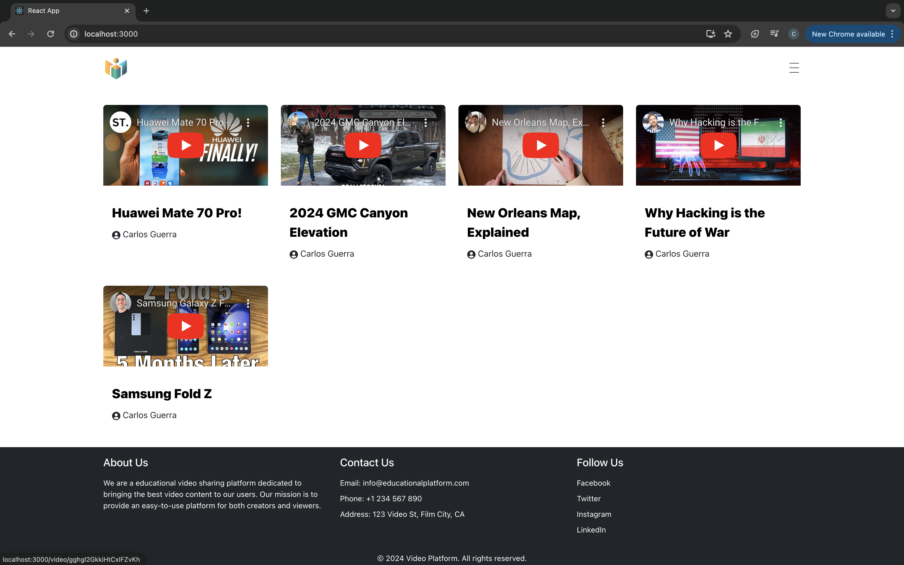
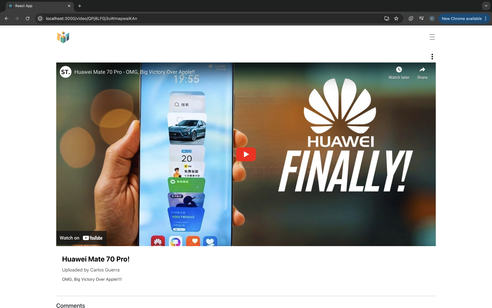
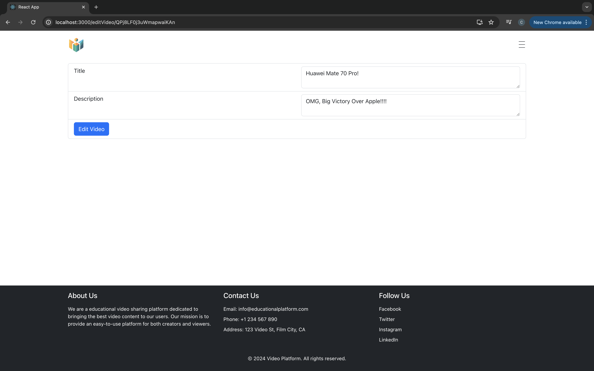
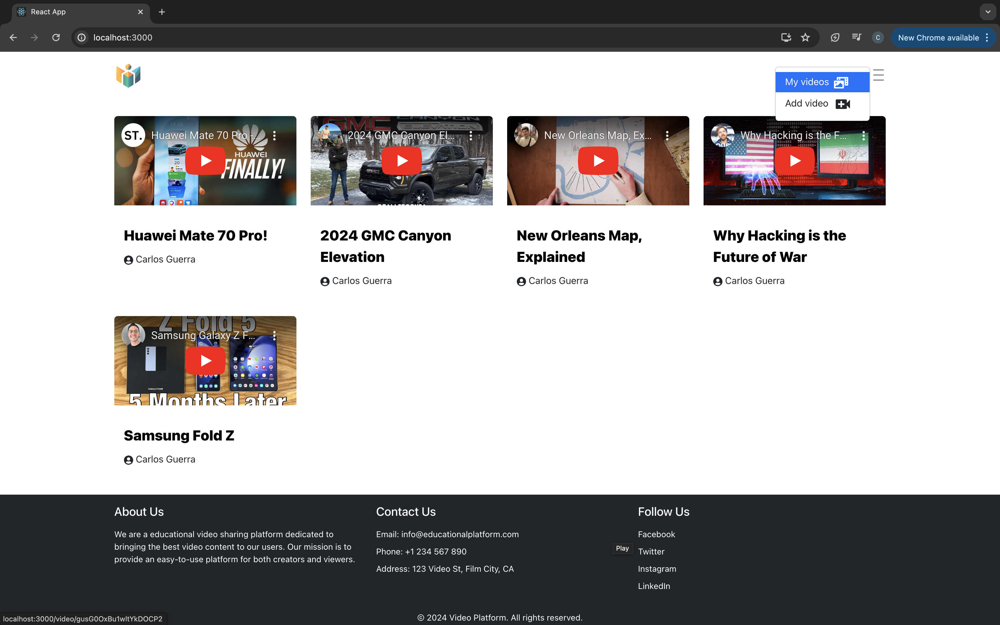
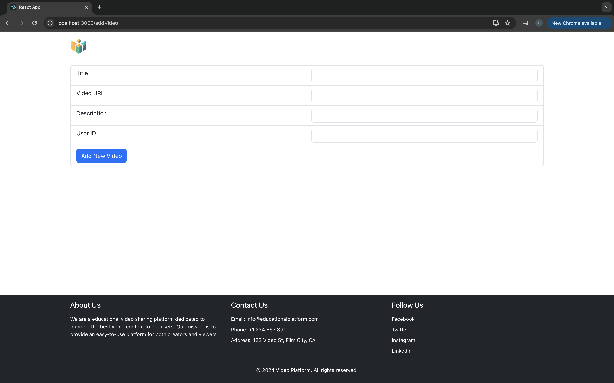

# Getting Started with Create React App

This project was bootstrapped with [Create React App](https://github.com/facebook/create-react-app).

## Available Scripts

In the project directory, you can run:

### `npm start`

Runs the app in the development mode.\
Open [http://localhost:3000](http://localhost:3000) to view it in your browser.

The page will reload when you make changes.\
You may also see any lint errors in the console.


# Video Player Platform
### Overview
The Video Player Platform is an educational video sharing application that allows users to upload, view, and comment on videos. The platform leverages YouTube URLs to display videos through an iframe. Key features include:

Home logo redirects to the home screen.
A menu bar button provides options to add a video or return to the home screen.
Video cards display YouTube videos and redirect to a detailed view when clicked.
Detailed video view includes video playback, comments, and an option to add comments.
Edit option available for videos in the detailed view.
Responsive design ensures usability on various screen sizes.
Features
Home Screen: Displays all uploaded videos as cards.
Video Upload: Allows users to add new videos using YouTube URLs.
Video Detail View: Shows the video in a larger view with comments and an option to add new comments.
Edit Video: Users can edit video details like title and description.
Responsive Design: Adapts to different screen sizes.

## Installation and Setup
### Prerequisites
Node.js
npm (Node package manager)

### Installation
Clone the repository:

```
git clone https://github.com/carlosemi/Video_Player.git
cd video_player
```

### Install the dependencies:

```
npm install
```

### Running the Application
Start the development server:

```
npm start
```

Open your browser and navigate to:
http://localhost:3000

## Dependencies
@reduxjs/toolkit
@testing-library/jest-dom
@testing-library/react
@testing-library/user-event
axios
bootstrap
mdb-react-ui-kit
react
react-bootstrap
react-dom
react-helmet-async
react-icons
react-redux
react-router-bootstrap
react-router-dom
react-scripts
react-toastify
redux
web-vitals

## Folder Structure
The project structure is as follows:

```bash
video_player
│
├── node_modules
├── public
├── src
│   ├── assets
│   │   ├── FULL_LOGO_COLOR.png
│   │   ├── FULL_LOGO_DARK.png
│   │   ├── FULL_LOGO_WHITE.png
│   │   ├── LOGO_ICON.png
│   ├── components
│   │   ├── CustomDropdown.jsx
│   │   ├── Footer.jsx
│   │   ├── Header.jsx
│   │   ├── Loader.jsx
│   │   ├── Video.jsx
│   ├── screens
│   │   ├── AddVideoScreen.jsx
│   │   ├── EditVideoScreen.jsx
│   │   ├── HomeScreen.jsx
│   │   ├── VideoScreen.jsx
│   ├── slices
│   │   ├── apiSlice.js
│   │   ├── videosApiSlice.js
│   ├── App.js
│   ├── App.css
│   ├── constants.js
│   ├── index.js
│   ├── index.css
│   ├── logo.svg
│   ├── reportWebVitals.js
│   ├── setupTests.js
│   ├── store.js
├── .gitignore
├── package-lock.json
├── package.json
└── README.md
```

## Screenshots

### Home Screen


### Video Screen


### Edit Video Screen


### Menu


### Add Video Screen



## Additional Information
### Home Screen
The home screen displays all videos in a grid format.
Clicking on a video card navigates to the video detail screen.

### Video Screen
The video detail screen shows the video, comments, and an option to add comments.
Users can click on the settings icon to edit the video details.

### Add Video
Users can add a new video by providing the title, YouTube URL, description, and user ID.

### Edit Video
Users can edit the video title and description from the video detail screen.

### Footer
The footer contains dummy links to About Us, Contact Us, and Follow Us sections.

For any issues or feature requests, please open an issue in the repository.